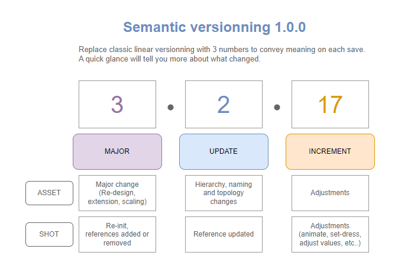

Here’s the formatted **Markdown file** with the requested additions:

---

# **Semantic Versioning for nopCommerce Plugins**

## **What is Semantic Versioning?**
Semantic Versioning (SemVer) is a versioning system that uses a three-part version number: **MAJOR.MINOR.PATCH**. It helps developers and users understand the impact of changes in software.  
- **MAJOR**: For incompatible or breaking changes.  
- **MINOR**: For new features that are backward-compatible.  
- **PATCH**: For bug fixes or small improvements that don’t affect compatibility.

By following Semantic Versioning, developers can clearly communicate the scope and impact of updates, ensuring smoother upgrades and better plugin management.

---

## **Where to Update Plugin Versions in nopCommerce**
To update the version of a plugin in nopCommerce:
1. Open the plugin's `plugin.json` file located in the plugin’s root directory.
2. Look for the `Version` field.
3. Update the version number according to the changes made (e.g., `1.0.0` → `1.1.0` for a new feature).
4. Save the file and rebuild the project if necessary.

---

## **Changes and Versioning in nopCommerce Plugins**

Here’s a detailed table categorizing the changes you can make in a **nopCommerce plugin** and how they affect the version number according to **Semantic Versioning**. The table identifies whether the changes are **major**, **minor**, or **patch**, and specifies which part of the version number should be incremented.

---

### **Major Changes**

| **Type of Change**                              | **Category**   | **Version Part to Increment** | **Description**                                                                                             |
|-------------------------------------------------|----------------|-------------------------------|-------------------------------------------------------------------------------------------------------------|
| **Breaking Changes**                           | **Major**      | **MAJOR**                    | Changes that break compatibility with previous versions of nopCommerce or other plugins.                   |
| - Removing or renaming a public method/class   | **Major**      | **MAJOR**                    | Removing or renaming methods or classes used by other parts of the application or plugins.                 |
| - Changing the plugin's database schema (breaking compatibility) | **Major**      | **MAJOR**                    | Modifying or removing existing tables/columns in a way that breaks existing functionality.                 |
| - Changing the plugin architecture             | **Major**      | **MAJOR**                    | Switching to a completely new structure, such as moving from a widget to a payment plugin.                 |
| - Changing required nopCommerce version        | **Major**      | **MAJOR**                    | Requiring a higher version of nopCommerce that breaks compatibility with older versions.                   |
| - Removing or renaming configuration settings  | **Major**      | **MAJOR**                    | Removing or renaming configuration settings used by users or other plugins/themes.                         |

---

### **Minor Changes**

| **Type of Change**                              | **Category**   | **Version Part to Increment** | **Description**                                                                                             |
|-------------------------------------------------|----------------|-------------------------------|-------------------------------------------------------------------------------------------------------------|
| **New Features**                               | **Minor**      | **MINOR**                    | Adding new features or functionality without breaking backward compatibility.                              |
| - Adding new public methods/classes            | **Minor**      | **MINOR**                    | Adding new methods or classes that extend functionality without breaking existing code.                    |
| - Adding new configuration settings            | **Minor**      | **MINOR**                    | Introducing new settings that don’t affect existing configurations.                                        |
| - Adding new database tables/columns           | **Minor**      | **MINOR**                    | Adding new tables or columns without modifying or removing existing ones.                                  |
| - Adding support for new events/hooks          | **Minor**      | **MINOR**                    | Adding new event consumers or hooks for customization.                                                     |
| - Adding new UI components                     | **Minor**      | **MINOR**                    | Adding new views, widgets, or admin panel features.                                                        |

---

### **Patch Changes**

| **Type of Change**                              | **Category**   | **Version Part to Increment** | **Description**                                                                                             |
|-------------------------------------------------|----------------|-------------------------------|-------------------------------------------------------------------------------------------------------------|
| **Bug Fixes and Improvements**                 | **Patch**      | **PATCH**                    | Fixing bugs or making small improvements that don’t affect compatibility or features.                      |
| - Fixing a bug in existing functionality       | **Patch**      | **PATCH**                    | Resolving issues in the plugin’s code without adding new functionality.                                    |
| - Performance optimizations                    | **Patch**      | **PATCH**                    | Making performance improvements without changing functionality.                                             |
| - UI fixes (e.g., CSS/HTML adjustments)        | **Patch**      | **PATCH**                    | Fixing minor UI issues, such as layout or styling problems.                                                |
| - Updating documentation or comments           | **Patch**      | **PATCH**                    | Improving inline documentation or user guides without changing the plugin’s functionality.                 |
| - Fixing typos or incorrect labels             | **Patch**      | **PATCH**                    | Correcting minor text or label errors in the UI.                                                           |

---

## **Summary of Version Number Increments**
- **MAJOR**: Increment when making **breaking changes** (e.g., removing methods, breaking database schema compatibility, or requiring a higher nopCommerce version).
- **MINOR**: Increment when adding **new features** in a backward-compatible way (e.g., new methods, events, or UI components).
- **PATCH**: Increment when making **bug fixes** or non-breaking improvements (e.g., fixing bugs, UI tweaks, or performance optimizations).

---

### **Example**
Let’s assume your plugin starts at version **1.0.0**:
1. You add a new feature (e.g., a new event hook): Update to **1.1.0**.
2. You fix a bug in an existing feature: Update to **1.1.1**.
3. You remove a public method, breaking compatibility: Update to **2.0.0**.

This structured approach ensures clarity for developers and users when upgrading or maintaining plugins in nopCommerce.

--- 

This formatted file now includes an image, a brief description of Semantic Versioning, and instructions on where to update plugin versions in nopCommerce!