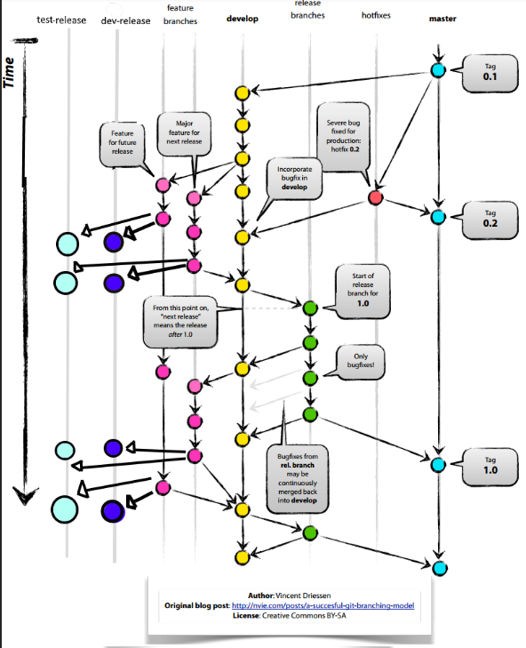

# Git Workflow

## Environments:

- Test Site
- Stage Site
- Live Site

## Required Branches:

- `master`/`main`/`production`
- `develop`
- `test`/`test_deploy`

## Branch Categories:

- `feature`: Manage your feature branches.
- `bugfix`: Manage your bugfix branches.
- `release`: Manage your release branches.
- `hotfix`: Manage your hotfix branches.

## Process:

1. **Feature Development:**
    - Developers create their `feature_xxx` branch from the `develop` branch.
    - After completing the feature, create a pull request to the `develop` branch.
    - `A reviewer approves the pull request after resolving any issues but does not merge it.`

2. **Testing:**
    - Multiple developers merge their different features into the `test_deploy` branch.
    - The `test_deploy` branch is deployed to the Test Site for testing by developers and QA.
    - Do not merge `test_deploy` into `feature_xxx` or any other branch.
    - Resolve and commit merge conflicts on the `test_deploy` branch.

3. **Client Approval:**
    - **After testing on the Test Site is done and the client approves the feature for production (`feature_xxx`), sync the `develop` branch in the feature branch.**
    - Merge the pull request of the feature into the `develop` branch, `squashing commits`. If the merge request was created earlier then no need to create again.

4. **Deployment to Live Site:**
    - When the client requests deployment to the Live Site, create a new `release_xxx` branch from the `main` branch.
    - Merge the `feature_xxx` into the `release_xxx` branch, squashing commits.
    - Deploy the `release_xxx` branch to the Stage Site for UAT.
    - Update plugins and other versions on this branch.
    - If needed, fix issues on the `feature_xxx` or `release_xxx` branches.
    - Once UAT is approved, merge `release_xxx` into `develop` and `master`, and deploy to the Live Site.

5. **Hotfix:**
    - For hotfixes, create a new branch from `master` and merge into both `master` and `develop`.

6. **Release Planning:**
    - Avoid including too many features in one release.
    - Plan for sprint-wise or batch-wise releases.

## Versioning Convention

## Branch Naming Conventions:

- **Feature Branches** :  Use the prefix `feature/`. For instance, `feature/login-system`.
- **Bugfix Branches** : Use the `prefix bugfix/`. For example, `bugfix/header-styling`.
- **Hotfix Branches** : Use the prefix `hotfix/`. For instance, `hotfix/critical-security-issue`.
- **test Branches** :  Use the prefix `test/`. For example, `test/test-product-export`.
- **Release Branches** : prefix `release/`. For example, `release/v1.0.1`.

**Note:**
- 
- Resolve merge conflicts on the `test_deploy` branch.
- Squash commits while merging into `develop`, `master`, and `release_xxx`.
- Plan releases carefully, considering client approvals and UAT testing.
- A reviewer approves the pull request after resolving any issues but does not merge it.
- Delete the feature branch right after releasing. 

**Don't -**
-
-  merge `test_deploy` into `feature_xxx` or any other branch.
-  merge `feature_branch` into `develop` branch without client approval.
-  create branch without following proper naming convention.
-  upload plugin directly to live site.

